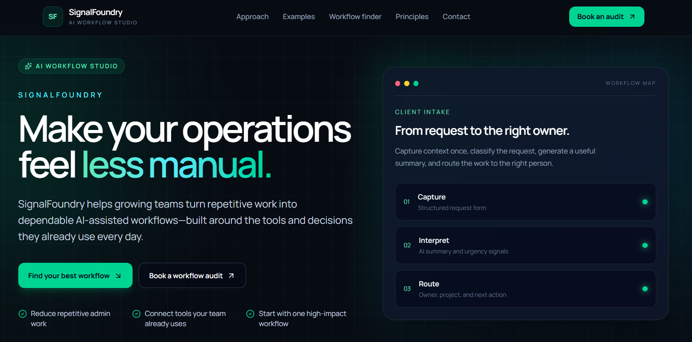
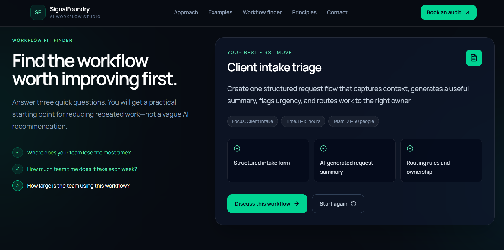

# SignalFoundry

> A responsive B2B workflow-studio concept that helps teams identify operational friction and explore practical AI-assisted workflow starting points.



## Overview

SignalFoundry is a frontend product concept built around a simple premise: teams should start with the repeated work that creates friction, not with broad automation promises.

The site guides visitors through practical workflow services, conceptual workflow scenarios, and an interactive **Workflow Fit Finder**. The finder uses a short multi-step assessment to recommend a useful workflow starting point, such as client-intake triage, internal knowledge support, reporting, or support-request routing.

This is a portfolio concept project. It does not claim client work, performance results, or live lead collection.

## Live site

- [Live demo ] (https://signalfoundry-yaredlb.vercel.app/)
- [Portfolio case study](http://localhost:3000/work/signalfoundry)

## Screenshots

### Homepage


### Workflow Fit Finder



## Features

- Responsive dark B2B workflow-studio interface
- Product-focused homepage with a workflow-map visual
- Workflow services that cover audit, automation design, AI-assisted operations, and handoff
- Workflow Scenarios section with portfolio-safe conceptual examples
- Three-step Workflow Fit Finder powered by React state
- Dynamic recommendations based on the visitor's selected friction area
- Animated progress and result states using Motion
- Accessible form labels, required-field validation, autocomplete hints, and visible focus styles
- Transparent demo contact experience that does not submit visitor data
- Smooth in-page anchor navigation for all major sections
- Custom SignalFoundry SVG favicon and updated metadata

## Workflow Fit Finder

The finder asks users three questions:

1. Where does the team lose the most time?
2. How much team time does the workflow take each week?
3. How large is the team using the workflow?

The selected friction area determines the primary recommendation:

| Friction area         | Recommendation               |
| --------------------- | ---------------------------- |
| Client intake         | Client intake triage         |
| Internal knowledge    | Internal knowledge assistant |
| Reporting and updates | Automated status reporting   |
| Customer support      | Support request triage       |

The time and team-size responses are shown as contextual information in the final result. The recommendation intentionally remains a starting point for workflow discovery rather than an automated business diagnosis.

## Tech stack

- [React](https://react.dev/)
- [Vite](https://vite.dev/)
- [Tailwind CSS](https://tailwindcss.com/)
- [Motion](https://motion.dev/)
- [Lucide React](https://lucide.dev/)

## Project structure

```text
src/
├── assets/                 # Project images and original visual assets
├── components/
│   ├── ContactUs.jsx       # Demo contact form and success state
│   ├── Footer.jsx          # Site footer and in-page navigation
│   ├── Hero.jsx            # Hero message and workflow-map visual
│   ├── Navbar.jsx          # Responsive site navigation
│   ├── OurWork.jsx         # Workflow Fit Finder interaction
│   ├── ServiceCard.jsx     # Reusable workflow-service card
│   ├── Services.jsx        # Workflow services section
│   ├── Teams.jsx           # Workflow design principles section
│   ├── TrustedBy.jsx       # Systems and tools context strip
│   └── WorkflowScenarios.jsx # Conceptual workflow examples
├── App.jsx                 # Page composition
├── index.css               # Global styles and Tailwind directives
└── main.jsx                # React entry point

public/
├── favicon.svg
├── signalfoundry-homepage.jpg
└── signalfoundry-workflow-finder.jpg
```

## Run locally

### Prerequisites

- Node.js 18 or newer recommended
- npm

### Installation

```bash
git clone https://github.com/yaredlb/SignalFoundry.git
cd SignalFoundry
npm install
npm run dev
```

Vite will print the local development URL in your terminal. It is commonly `http://localhost:5173`.

## Production build

Create an optimized production build:

```bash
npm run build
```

Preview the generated production build locally:

```bash
npm run preview
```

## Design decisions

### Start with workflow friction

The content focuses on repeated tasks, unclear handoffs, missing context, and review points. This keeps the site grounded in practical operational problems rather than generic AI claims.

### Keep people in control

AI is framed as support for intake, classification, summaries, drafting, reporting, and routing. The interface emphasizes reviewable workflows and human decision-making where it matters.

### Show interaction, not only marketing

The Workflow Fit Finder gives the concept a meaningful state-driven interaction. It captures three answers, moves through a controlled sequence, derives a recommendation from the selected friction type, and supports a full reset flow.

### Be transparent about the demo

The contact section intentionally shows a local success state instead of submitting information. This makes the project suitable for a portfolio while avoiding the appearance of collecting visitor data without a real contact workflow.

## Accessibility notes

- Semantic headings and content sections structure the page.
- Interactive controls use native buttons and links.
- Form fields have visible labels and required validation.
- Name, email, and organization inputs use browser autocomplete hints.
- Focus states are visible for keyboard users.
- UI icons that are decorative use `aria-hidden="true"`.
- Screenshot alternative text describes the visible interface rather than only calling the images screenshots.

## Future improvements

- Connect the contact form to a real form-delivery service or backend.
- Add a privacy policy before collecting visitor information.
- Add a real scheduling link for workflow-audit calls.
- Add additional recommendation logic based on time commitment and team size.
- Add automated accessibility checks and component tests.
- Add analytics only after documenting visitor privacy choices.

## Author

Designed and developed by **Yared LB** as a frontend portfolio concept.

## License

This project is available for portfolio and learning purposes. Add a formal license file if you plan to make reuse terms explicit.
